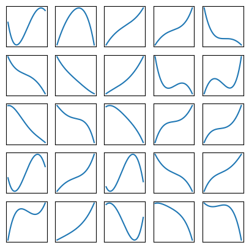

# ➕Integral-Calculator 


## 🗺️A world without numerical methods

Let's imagine a world where Riemann integral's were never meant to be computed through numerical methods. Could we build a tool that can do it for us? The answer is **yes**.

Usually, integrals are computed through summing the heights of a function multiplying them by a certain width, what is called the [trapezoidal rule](https://en.wikipedia.org/wiki/Trapezoidal_rule). For high dimensions (multiple integrals) the computation might be difficult, specially when the bounds of the integral are strange or depend on the integration variables.


The ''solution'' to this problem could be training a **Neural Network** (**NN**) to do the job for us. Obviously, for 1 variable functions the job could be counterproductive; this is just an exercise to learn [**TensorFlow**](https://www.tensorflow.org/?hl=es-419).

The example we will use will be the integration through the $(-3,3)$ interval.

## 📑Preparing the dataset

Firstly, we have to import the libraries that we will use.

```Python
import matplotlib.pyplot as plt
import tensorflow as tf
import numpy as np
```

The dataset to train the model will be a list of polynomial functions (of order 4) and they correspondant area. Since they are polynomial, the area can be calculated analytically (that was the whole starting point).

```math
\begin{align}
f(x)=&Ax^4+Bx^3+Cx^2+Dx+E \\
F(x)=&\frac A5x^5 + \frac B4 x^4 + \frac C3 x^3 + \frac D2 x^2 + Ex+K \\
\int_{-3}^3f(x)dx =& F(3)-F(-3)
\end{align}
```

The parameters $A,B,C,D,E,F$ of the function will be randomly generated. So, we make some functions that return all these types of data given a ``numpy`` linspace (which is the domain of the function). The type of functions that will be passed to the **NN** can be found and explored in this **desmos** project. There, you can check how the functions change when modifying their parameters.

```Python
def primitive(A, B, C, D, E, x):
  return A / 5 * x ** 5 + B / 4 * x ** 4 + C / 3 * x ** 3 + D / 2 * x ** 2 + E * x

def integral(Xarray, A, B, C, D, E):
  min = Xarray[0]
  max = Xarray[np.shape(x)[0] - 1]
  return primitive(A, B, C, D, E, max) - primitive(A, B, C, D, E, min)

def polynomial(Xarray):
  A = np.random.uniform(-0.01, 0.01)
  B = np.random.uniform(-0.1, 0.1)
  C = np.random.uniform(-0.1, 0.1)
  D = np.random.uniform(-1, 1)
  E = np.random.uniform(-1, 1)
  dim = np.shape(Xarray)
  return [np.array([[integral(Xarray, A, B, C, D, E)]]), A * Xarray ** 4 + B * Xarray ** 3 + C * Xarray ** 2 + D * Xarray + E]
```

Now, we prepare $5000$ samples of these functions and slice them into the input and output:

```Python
x = np.linspace(-3, 3, 1000)
n_samples = 5000
data = [polynomial(x) for i in range(n_samples)]
input = np.array([data[i][1] for i in range(n_samples)])
output = np.array([data[i][0] for i in range(n_samples)])
```

We can plot some of them so you get the idea of how the dataset looks:

```Python
plt.figure(figsize=(5,5))
for i in range(25):
    plt.subplot(5,5,i+1)
    plt.xticks([])
    plt.yticks([])
    plt.grid(False)
    plt.plot(x, input[i])
    #plt.xlabel(class_names[label])
plt.show()
```


Finally, we separate the dataset into a training group and a testing one. We will choose $80$% of the data to train our **NN** and $20$% to test its accuracy.

```Python
d_train = input[:int(n_samples * 0.8)]
y_train = output[:int(n_samples * 0.8)]

d_test = input[int(n_samples * 0.8):]
y_test = output[int(n_samples * 0.8):]
```

Now, everything is ready to train the **NN**.

## 🧠Defining and training the Neural Network

The layer scheme of the **NN** would be clear from a mathematical point of view. If we use a model with 2 layers of this form:

```math
\begin{align}
\begin{matrix}
\begin{pmatrix}x_1\end{pmatrix}\\
\begin{pmatrix}x_2\end{pmatrix}\\
\begin{pmatrix}x_3\end{pmatrix}\\
\vdots\\
\begin{pmatrix}x_n\end{pmatrix}
\end{matrix}
\Longrightarrow
\begin{pmatrix}I\end{pmatrix}
\end{align}
```

Where the final neuron is **dense**; the **NN** would eventually learn that the weights ($\omega_i$) are all just the length of the ``numpy`` linspace ($\omega=6/1000$) and the bias is $0$. That is, 

```math
I = \sum_i^nx_i\cdot \omega
```

This formula is the **Riemann** integral!

So, we don't want to use these type of architecture, since it is too obvious. Instead, we will use a simple 3 layer one:

```math
\begin{align}
\begin{matrix}
\begin{pmatrix}x_1\end{pmatrix}\\
\begin{pmatrix}x_2\end{pmatrix}\\
\begin{pmatrix}x_3\end{pmatrix}\\
\vdots\\
\begin{pmatrix}x_n\end{pmatrix}
\end{matrix}
\Longrightarrow
\begin{matrix}
(\text{hidden})\\
\begin{pmatrix}y_1\end{pmatrix}\\
\begin{pmatrix}y_2\end{pmatrix}\\
\begin{pmatrix}y_3\end{pmatrix}\\
\vdots\\
\begin{pmatrix}y_n\end{pmatrix}\\
\end{matrix}
\Longrightarrow
\begin{pmatrix}I\end{pmatrix}
\end{align}
```

This can be achieved by using a sequence of ``tf.keras.layers.Dense`` layers, using as input something with shape ``x`` (the input array). The hidden one will have the same shape as the input.

```Python
model = tf.keras.Sequential([
    tf.keras.layers.Dense(units=np.shape(x)[0], input_shape=np.shape(x)),
    tf.keras.layers.Dense(units=1)
])
```

Then, we compile it with the ``Adam`` optimizer (using some step parameter that will be figured out by trial-error). The loss function used will be the mean squared error, which is the usual for these cases.

```Python
model.compile(loss='mean_squared_error',
              optimizer=tf.keras.optimizers.Adam(0.0001))
```

To train it, we use the ``.fit`` method. We will feed the data in batches of 32 and will relook at the data 20 times (to avoid overfitting), those are called the epochs.

```Python
history = model.fit(d_train, y_train, epochs=20, batch_size = 32, verbose=True)
```

## 🧪Testing

